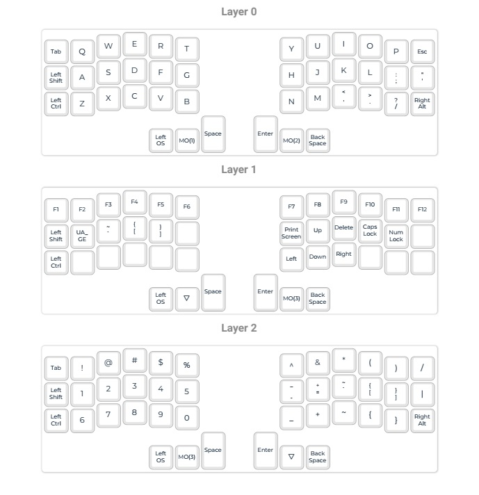

# tknbrd0

## Intro
### ( !ACHTUNG! work in progress, use by your own risk! )

_I'm Roma and I'm maker, don't wait - just make it! =)_

After a couple of sleepless nights, I decided to get my hands dirty with this sweet and diverse world of mechanical keyboards. As i understood on my way to my current daily driver it's quite interesting challenge. My main idea was to make a cheap keyboard, that can guide me forward in this hobby. 

So, i made a rough sketch of the location of my fingers to understand how far i must go with [ergogen](https://ergogen.xyz/) and then use spacing of switches in KiCad to make a PCB. Also this isn't a bad idea to play around with encoders and small OLED display in my project. As it usually almost everytime happens with first try, i made some mistakes ( learned some lessons :D ) and realize this _after_ i got PCBs from manufacturer. It's not critical, but in some points it could be just unexpectable for those, who would repeat my project. 

By the way here is PCBs appearance:

 WPM and remix of [bongo cat animation](https://www.reddit.com/r/olkb/comments/h00a8b/i_made_an_oled_animation_of_bongo_cat_that/) is showing on my OLED (of course with picture of my cat instead of original one!). With encoders i can scroll my feed, and also fast forward/backward the video by 5 seconds. Encoders is very interesting feature in keyboards and detailed explanation of this you can check in [QMK Docs](https://docs.qmk.fm/features/encoders).

## Keymap

My keyboard has a 42 keys, and it planned to use with QWERTY layout. For me is also iportant to have access to ukrainian letter Ґ, Ї, and some umlaut letters
Ä, Ö, Ü. I have now a laptop with QWERTZ layout, so have a keyboard with comfortable QWERTY is must have for me. So here is the keymap:

## Case

In file 'path_for400x300.svg' in this repo you can find a complete graphical outline for lasercutted case. I used a 3 mm acrylic sheet and laser in local FabLab.

## Firmware 

I created a fork of QMK firmware [here](https://github.com/tikinson/qmk_firmware) and [here](https://github.com/tikinson/qmk_firmware/tree/master/keyboards/tknbrd/tknbrd0) is tknbrd0 is located inside of QMK fork.

So you can compile firmware from fork or you can find binaries in 'FW' directory of this repo.

## Some important notes

1. Footprint for OLED is mirrored, so i use wires and simple pair of acrylic pieces to hold it with glue (really not a clearest design decision, but it just a first experience, so when it works it works).
2. Case: it's very important to solder RPI Pico a bit higher that it could be to prevent collision with acrylic case!!!
3. Encoders may have strange behaviour because they are connected to one pin. it was a bad decision and when reset keyboard isn't working i just rotate them together for first and then separately, so after this magical manipulation they works as usual.

## BOM

| Designator       | Footprint                                                        | Quantity | Value                 | LCSC Part #      |
|------------------|------------------------------------------------------------------|----------|-----------------------|------------------|
| D1 - D42         | Diode_SOD-123                                                   | 42       | Diode                 |                  |
| EXSW1, EXSW2     | RotaryEncoder_Alps_EC11E-Switch_Vertical_H20mm_CircularMountingHoles | 2        | RotaryEncoder_Switch   |                  |
| J1               | OLED_128x64                                                      | 1        | Conn_01x04            |                  |
| S1 - S42         | MX_PCB_1.00u                                                    | 42       | Keyswitch             |                  |
| U1               | Raspberry_Pi_Pico                                               | 1        | Raspberry_Pi_Pico     |                  |
| rD1              | D_SOD-523                                                       | 1        | 1N4148WT              | C232841          |
| rLED1 - rLED42    | YS-SK6812MINI-E-withCUTOUT                                      | 42       | YS-SK6812MINI-E       |                  |

Lasercutting, Knob, Switches all this is you can easily find on market on your personal preferences. All that included in BOM is recommended, only LED is optional.
